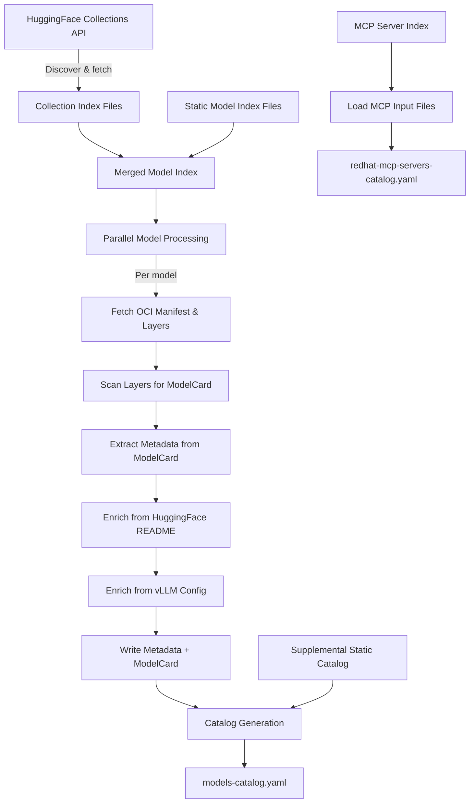
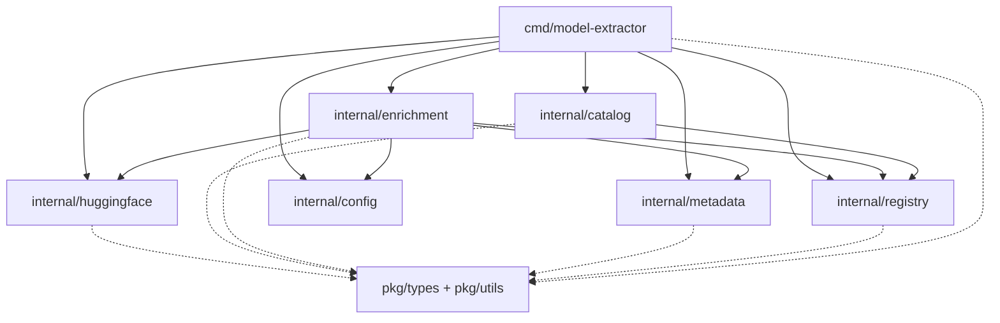
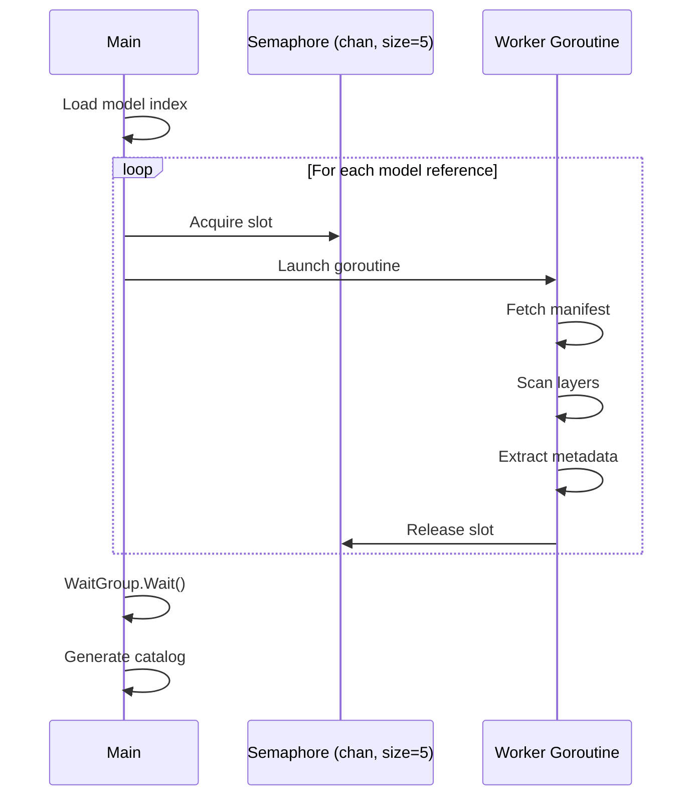

# Architecture

This document describes the high-level architecture of the model-metadata-collection project.

## Overview

The system extracts model metadata from Red Hat AI ModelCar container images and HuggingFace collections, producing structured catalogs for downstream consumption. It processes OCI container images in parallel, scans layers for modelcard annotations, enriches metadata from HuggingFace, and generates YAML catalogs.

## Data Flow



## Package Structure



> **Note**: `cmd/metadata-report` and `internal/report` (metadata reporting tool) are omitted for clarity.
> Dashed edges to `pkg/` indicate shared type and utility dependencies used by nearly every package.

### `cmd/model-extractor/`

Main CLI application. Orchestrates the full pipeline: HuggingFace collection processing, parallel ModelCar image extraction, metadata enrichment, and catalog generation. Uses a semaphore pattern with `sync.WaitGroup` to limit concurrent goroutines (default: 5).

### `internal/catalog/`

Catalog generation and management. Loads static catalogs, merges extracted metadata from processed models, deduplicates entries, and writes the final `models-catalog.yaml` output. Also handles MCP server catalog generation by aggregating individual server input files into `redhat-mcp-servers-catalog.yaml`.

### `internal/config/`

Centralized configuration, primarily the single source of truth for supported model families (`SupportedModelFamilies`). Used by enrichment and text normalization packages to ensure consistent model family matching.

### `internal/enrichment/`

Metadata enrichment pipeline. Matches container registry models to HuggingFace entries using normalized name similarity scoring. Extracts tool-calling configuration from YAML frontmatter, applies vLLM recommended configs, and generates README content sections.

### `internal/huggingface/`

HuggingFace API client and collection processing. Discovers validated model collections, fetches collection metadata, parses version information from titles, and generates version-specific index files in `data/`.

### `internal/metadata/`

Metadata parsing from modelcard content. Extracts structured fields (dates, descriptions, providers) from markdown modelcards, converts dates to Unix epoch timestamps, and validates extracted values.

### `internal/registry/`

Container registry operations using `github.com/containers/image/v5`. Fetches OCI manifests, extracts layer information, parses image references, and retrieves registry-level metadata (tags, annotations).

### `pkg/types/`

Shared type definitions used across packages: `CatalogMetadata`, `ModelMetadata`, `HFCollection`, `VLLMConfig`, `MCPServerMetadata`, `MCPServersCatalog`, and related structs.

### `pkg/utils/`

Shared utilities: text normalization (`NormalizeModelName`), similarity scoring, template rendering (Go templates for vLLM config and tool-calling sections), and file I/O helpers.

## Concurrency Model

The main processing loop uses a bounded parallelism pattern:



## Key Dependencies

| Dependency | Purpose |
|-----------|---------|
| `github.com/containers/image/v5` | OCI container image manipulation and registry access |
| `gopkg.in/yaml.v3` | YAML marshaling/unmarshaling for catalogs and configs |
| `golang.org/x/text` | Unicode text processing for name normalization |

## Output Structure

```
output/{sanitized-manifest-ref}/
  models/
    modelcard.md      # Extracted modelcard content
    metadata.yaml     # Structured metadata (name, provider, dates, etc.)

data/
  models-catalog.yaml              # Final merged catalog
  validated-models-catalog.yaml    # Validated models catalog
  redhat-mcp-servers-catalog.yaml  # MCP servers catalog
  hugging-face-redhat-ai-validated-v*.yaml  # Version-specific HF indices

input/mcp_servers/
  *.yaml                           # Individual MCP server metadata files
```
